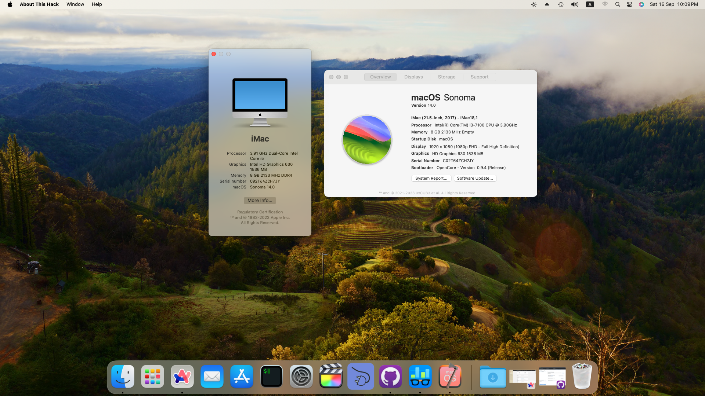
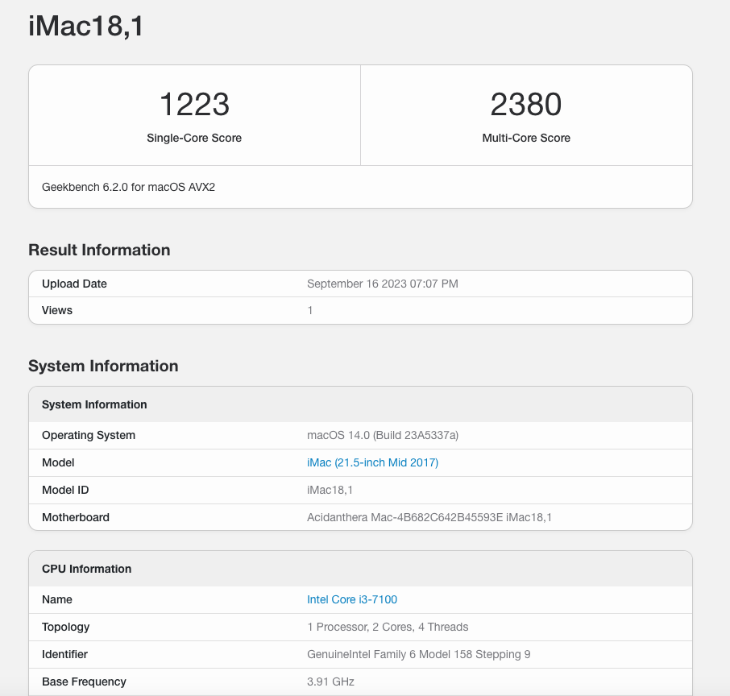

# 🍎 GA-B250M-D3H OpenCore Hackintosh
## ***IMPORTANT !!!!***

Unfortunately the time has come. I'm upgrading to a newer computer and I ***wont be able to*** update this EFI anymore. If anybody is interested of forking this I have no problem. As soon as I get the new PC I will hopefully make another EFI.
## 📸 Screenshots




## 🖥️ Hardware & System

| Name | Model Version |
| -------- | ----------------------------- |
| Motherboard | Gigabyte B250M-D3H |
| BIOS Version | F10 |
| CPU | Intel i3 7100 |
| Graphics | Intel HD Graphics 630 |
| Sound Card | ALC892 |
| NIC | i219-v |
| SSD | Intel SATA SSD |
| System | macOS Ventura 13.3.1 |
| Bootloader | OpenCore 0.9.2 |
| Models | iMac18,1, iMac18,2, iMac18,3 | 

## 🔧 BIOS settings

### `Gigabyte B250M-D3H` motherboard
Items in bold are mandatory.
- `M.I.T`
- `Miscellaneous Settings`
   - **`CFG Lock` = `Disabled`**
- `BIOS`
   - **`Fast Boot` = `Disabled`**
   - `Windows 8/10 Features` = `Windows 8/10`
   - **`CSM Support` = `Disabled`**
- `Peripherals`
   - `Initial Display Output` = `IGFX`
   - **`SW Guard Extensions (SGX)` = `Disabled`**
   - `Super IO Configuration`
     - `Serial Port` = `Disabled`
     - `Parallel Port` = `Disabled`
   - `USB Configuration`
     - **`Legacy USB Support` = `Enabled`**
     - **`XHCI Hand-off` = `Enabled`**
   - `SATA And RST Configuration`
     - **`SATA Mode Selection` = `AHCI`**
- `Chipset`
   - **`VT-d` = `Disabled`**
   - `Internal Graphics` = `Enabled`
   - `DVMT Pre-Allocated` = `64M`
   - `DVMT Total Gfx Mem` = `256M`

## ⚠️ Known Issues

* Unable to sleep, it will automatically wake up immediately after sleep, 
for a temporary solution use the following command to prevent entering 
sleep 
mode:
   ``` bash
   sudo pmset -a disablesleep 1
   ```
   When this value is set to 1, all sleep functions are disabled. The 
Sleep item in the Apple menu is also dimmed ("grayed out"). When set to 0, 
the sleep functionality will be restored.

## ‼️ Important Notes

* This repo is a modified and updated version of this EFI: 
https://github.com/beyondgary/Hackintosh_i5-7500_B250_HD630_EFI 

* If you are still haven't updated your BIOS ***_DO IT NOW_***
  
* If the display turns black on boot **plug out** HDMI or DP and then **plug it back in.**

* After installation **change the SMBIOS** to get Apple ID working. Follow Dortania's OpenCore Guide